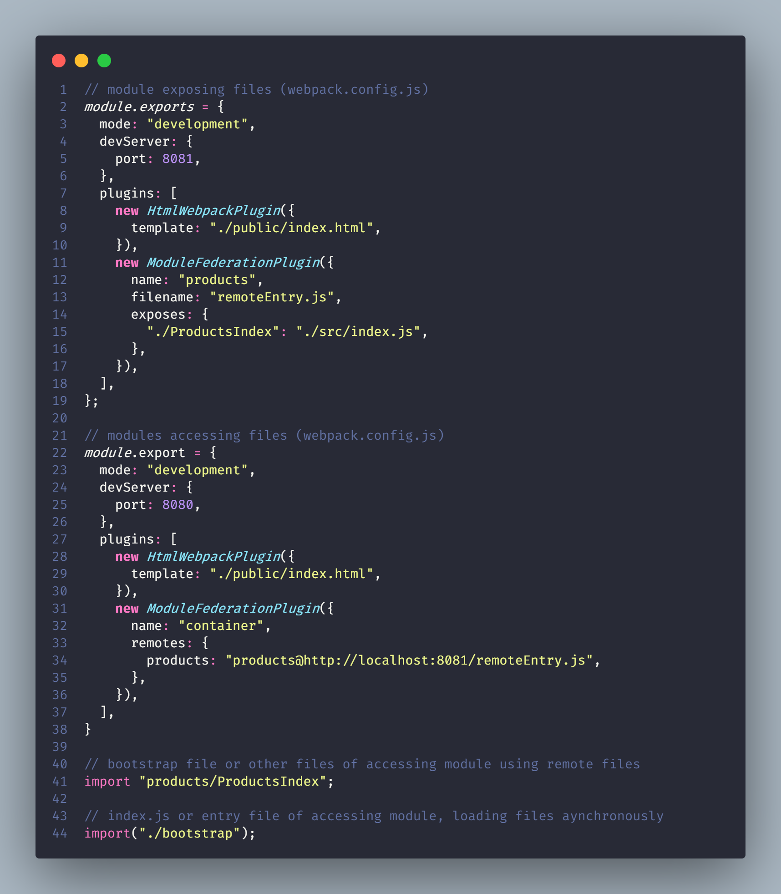

# Micro Frontends

`what are microfrontends ?` Divide a monolithic app into multiple, smaller apps and each is responsible for distinct feature.

`why use them ?` Multiple engineering teams can work in isolation and each smaller app is easy to understand and make changes to.

`we should be very careful while choosing the package verisons for the whole project otherwise it might break other micro frontends.`

`All micro-frontends are loaded by one main application called container that houses all of them.`

## Webpack and Webpack Module Federation Plugin configuration

- `webpack` package compiles and bundles the files into a single webpack file.
- `webpack-dev-server` package watch for the files generated by `webpack` and serve them.
- `html-webpack-plugin` package adds files generated by `webpack` and attach them to template file provided to it which is served by `webpack-dev-server`
- `module-federation-plugin` package let us expose the files from current project to outside projects. This plugin takes `name`, `filename` and `exposes` as configuration where name is the name of the module and filename is the the entry point file which has directives to load the exposed files and it's dependencies. The exposed files are generated separately other than the normal build files to be used by other modules.
- The projects that need to access files that are exposed by a module should setup `module-federation-plugin` with config option of `remotes` which is an object that takes module name to access as key and value is `modulename@http://localhost:moduleport/entryfilename.js`
- The index(entry file of container) should load the "bootstrap" file with `import("bootstrapfilepath")` so that all the local modules and remote modules required by bootstrap file and it's dependencies are loaded asynchronously.
- All the remote files can be imported with `import "modulename/filename"` where filename is key inside `exposes` configuration object of the module being accessed.
- The `shared` property in configuration can be used to list the shared dependencies, which is used to load only a single copy of the dependencies that are used by different applications.

**NOTE: all the other apps as well should use bootstraping technique to load code asynchronously to work as standalone applications**

- Browser creates a global variable for every id in the html file, name of variable being the id itself.
